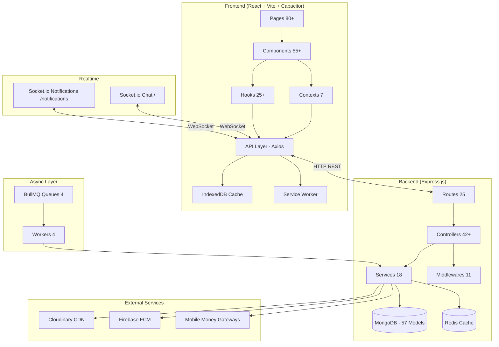

# 📊 HDMarket — Comprehensive App Analysis

> Generated: June 4, 2026

---

## 1. Project Identity

| Aspect | Detail |
|---|---|
| **Name** | HDMarket / QuickMarket |
| **Target Market** | Central Africa — Brazzaville, Republic of Congo |
| **Type** | Full-stack mobile-first e-commerce marketplace |
| **Philosophy** | Taobao-inspired: fast discovery, seller-first, category-driven, COD/Mobile Money payments |
| **Monorepo** | `backend/` + `frontend/` + `scripts/` + `ag/` (proposals) |

---

## 2. Tech Stack

### Backend (`/backend`)

| Layer | Technology |
|---|---|
| **Runtime** | Node.js + Express.js (ES modules) |
| **Database** | MongoDB via Mongoose (57+ models) |
| **Cache** | Redis with memory fallback |
| **Job Queue** | BullMQ (4 queues) |
| **Realtime** | Socket.io (2 namespaces: chat + notifications) |
| **Storage** | Cloudinary (images, PDFs) |
| **Push Notifications** | Firebase Admin (FCM) |
| **Auth** | JWT + bcryptjs, session management, token blacklisting |
| **Validation** | Joi schemas |
| **Email** | Nodemailer (password reset) |
| **Payments** | MTN Money, Airtel Money, CinetPay, Flutterwave, PayDunya (COD primary) |
| **Security** | Helmet, CORS, rate limiting, idempotency middleware, maintenance mode |

### Frontend (`/frontend`)

| Layer | Technology |
|---|---|
| **Framework** | React 18 + React Router v6 (lazy loading) |
| **Styling** | TailwindCSS v4 + `tailwindcss-animate` + `tailwindcss-safe-area` |
| **State** | React Context (7 contexts), React Query v5 (TanStack) |
| **Animation** | Framer Motion + Motion |
| **UI Primitives** | Radix UI, Lucide React icons |
| **Charts** | Recharts |
| **Carousels** | Embla Carousel, Swiper |
| **PDF/Excel** | jsPDF, ExcelJS, xlsx |
| **HTTP** | Axios with retry logic, timeout profiles, offline support |
| **Mobile** | Capacitor 8 (iOS + Android), push notifications, splash screen |
| **Offline** | IndexedDB caching, service worker, offline queues |
| **Build** | Vite 7 |

### Dev Tools

| Tool | Purpose |
|---|---|
| `scripts/dev.js` | Runs both frontend and backend concurrently |
| `nodemon` | Backend hot reload |
| `Vite` | Frontend dev server & build |

---

## 3. Backend Architecture

### Full Route Map (25 route files)

```
/api/auth              — Register, login, password reset (code + email link), logout
/api/products          — CRUD, public feeds, highlights, installments, wholesale, pickup-only, top sales, analytics
/api/orders            — Checkout, buyer/seller order flows, drafts, inquiry, delivery proof, admin order management
/api/admin             — Dashboard stats, users CRUD, shop verification, payments, boosts, restrictions, audit logs, cache stats
/api/cart              — Add/remove/update cart items
/api/categories        — Category tree, CRUD with ordering
/api/search            — Product search with filters, search analytics
/api/chat              — Support chat, templates (nested tree), sessions, attachments, reactions, search
/api/payments          — Payment proof submission, verification workflow
/api/boosts            — Boost requests (product, shop, homepage featured) with pricing
/api/disputes          — Order disputes with resolution workflow and abuse detection
/api/delivery          — Platform delivery, courier assignments, delivery proof
/api/courier           — Courier dashboard, assignment lifecycle
/api/shops             — Shop profiles, reviews, conversion requests (person → shop)
/api/settings          — App settings, site settings, network settings
/api/cities            — City management
/api/communes          — Commune management
/api/currencies        — Currency configuration
/api/devices           — Push notification token registration
/api/founder           — Founder intelligence, analytics, account control, notifications intelligence
/api/analytics         — Realtime analytics, seller analytics
/api/support           — Complaints, help center, feedback
/api/promo-codes       — Marketplace promo codes (CRUD + validation)
/api/preferences       — User preferences (language, currency, city, theme)
```

### Controllers (42+)

| Controller | Responsibility |
|---|---|
| `authController` | Authentication, registration, password reset |
| `productController` | Product CRUD, public feeds, highlights, top lists, views tracking |
| `orderController` | Checkout, buyer/seller/admin order management, drafts, inquiry |
| `adminController` | Users, shops, roles, restrictions, audit logs, dashboard stats |
| `adminOrderCommandCenterController` | Order alerts, command center, delay detection, installment sweeps |
| `cartController` | Cart items CRUD |
| `categoryController` | Category tree management |
| `searchController` | Product search with filters and ranking |
| `chatController` | Chat sessions, messages, templates, reactions |
| `paymentController` | Payment proof submission, verification |
| `boostController` | Boost requests and pricing |
| `disputeController` | Order dispute lifecycle |
| `deliveryRequestController` | Platform delivery requests |
| `deliveryGuyController` | Courier management |
| `courierDeliveryController` | Courier delivery operations |
| `shopController` | Shop profiles, reviews |
| `shopConversionController` | Person-to-shop conversion requests |
| `userController` | User profile, stats |
| `settingsController` | App/site settings |
| `siteSettingController` | Site-level configuration |
| `configController` | Runtime configuration |
| `deviceController` | Push notification tokens |
| `notificationController` | (via notificationService utils) |
| `ratingController` | Product ratings |
| `commentController` | Product comments |
| `complaintController` | User complaints |
| `contentReportController` | Content reporting |
| `feedbackController` | Improvement feedback |
| `helpCenterController` | Help center articles |
| `installmentController` | Installment payment management |
| `marketplacePromoCodeController` | Marketplace promo codes |
| `promoCodeController` | Seller promo codes |
| `prohibitedWordController` | Prohibited words management |
| `networkSettingController` | Network/mobile money settings |
| `founderController` | Founder-level operations |
| `founderAnalyticsController` | Founder analytics |
| `realtimeAnalyticsController` | Real-time analytics |
| `sellerAnalyticsController` | Seller-facing analytics |
| `reportController` | Report generation |
| `reviewReminderController` | Review reminder automation |
| `orderMessageController` | Order conversation messages |
| `taskCenterController` | Admin task center |

### Models (57+ MongoDB Schemas)

**Core Commerce:**
`User`, `Product`, `Order`, `Cart`, `Category`, `Payment`, `Notification`

**Boost & Promotion:**
`BoostRequest`, `BoostPricing`, `SeasonalPricing`, `PromoCode`, `PromoCodeUsage`, `MarketplacePromoCode`

**Social & Engagement:**
`Comment`, `Rating`, `ShopReview`, `ChatMessage`, `ChatSession`, `ChatTemplate`, `ProductView`

**Delivery:**
`DeliveryRequest`, `DeliveryGuy`, `DeliveryLog`

**Disputes:**
`Dispute`, `DisputeActionLog`

**Audit & Security:**
`AdminAuditLog`, `ProductAuditLog`, `CategoryAuditLog`, `AuditLog`, `ErrorLog`, `UserSession`, `PhoneBlacklist`, `ProhibitedWord`, `VerificationCode`, `DeviceToken`, `PushToken`

**Settings & Config:**
`AppSetting`, `SiteSetting`, `NetworkSetting`, `FeatureFlag`, `Currency`, `City`, `Commune`

**Analytics:**
`PlatformDailyAnalytics`, `SellerAnalyticsReport`, `SearchAnalytics`, `SearchHistory`

**Other:**
`AccountTypeChange`, `ShopConversionRequest`, `Complaint`, `Report`, `HelpCenter`, `ImprovementFeedback`, `Permission`, `OrderMessage`

### Queues & Workers (BullMQ)

| Queue | Worker | Purpose |
|---|---|---|
| `notificationQueue` | `notificationWorker` | Async notification dispatching (push, in-app, email) with retry logic |
| `orderAutomationQueue` | `orderAutomationWorker` | Auto-accept/reject/remind orders, installment SLA sweeps, delay detection |
| `realtimeAnalyticsQueue` | `realtimeAnalyticsWorker` | Analytics aggregation and computation |
| `sideEffectQueue` | `sideEffectWorker` | Post-mutation side effects (cache invalidation, search indexing, etc.) |

### Services (18 files)

| Service | Purpose |
|---|---|
| `configService` | Runtime configuration with cache layer |
| `auditLogService` | Audit trail logging for all admin actions |
| `notificationIntelligenceService` | Smart notification routing and batching |
| `notificationTemplateService` | Templated notification generation |
| `orderStatusFlowService` | Order state machine transitions |
| `orderDeliveryFeeService` | Delivery fee computation based on location/weight |
| `orderReliabilityAutomationService` | Order reliability rules and automation |
| `orderReviewReminderService` | Automated review prompts after delivery |
| `adminOrderAutomationService` | Admin-level order automation workflows |
| `installmentPolicyService` | Installment payment rules and validation |
| `platformDeliveryService` | Platform delivery orchestration |
| `presenceService` | Online/offline user presence tracking |
| `rbacService` | Role-based access control |
| `realtimeMonitoringService` | Server health and performance monitoring |
| `sessionSecurityService` | Token blacklisting, session invalidation |
| `sideEffectJobService` | Side effect job dispatching |
| `founderIntelligenceService` | Founder-level analytics and intelligence |
| `passwordResetService` | Email-based password reset flow |

### Middleware (11 files)

| Middleware | Purpose |
|---|---|
| `authMiddleware` | JWT verification, user attachment to `req` |
| `roleMiddleware` | Role and permission checks (admin, founder, delivery_agent, granular permissions) |
| `validate` | Joi schema validation for requests |
| `idempotencyMiddleware` | Mutation idempotency via `Idempotency-Key` header |
| `maintenanceModeMiddleware` | Maintenance mode toggling |
| `requestTracker` | Daily request counting and rate monitoring |
| `performanceMetrics` | Response time tracking and slow query detection |
| `requestContext` | Correlation ID and request context propagation |
| `requestReliability` | Timeout handling, slow request logging |
| `globalErrorHandler` | Centralized error handling and API error formatting |
| `categoryValidation` | Category-specific validation rules |

### Socket Namespaces

**Chat Socket (`/`)**
- Order conversation rooms: `conversation:{conversationId}`
- User rooms: `user:{userId}`
- Events: `orders:message:new`, `orders:message:updated`, `orders:message:deleted`, `orders:conversation:read`, `orders:conversation:updated`

**Notification Socket (`/notifications`)**
- Per-user rooms: `user:{userId}`
- Events: `notification`, `notifications:refresh`
- Online presence tracking with Redis + local cache
- Heartbeat-based presence (25s default)

---

## 4. Frontend Architecture

### Pages (80+ — All Lazy Loaded)

**Home & Discovery:**
`Home`, `Discover`, `Products`, `CategoryProducts`, `CityProducts`, `AdvancedSearch`

**Product Pages:**
`ProductDetails`, `ProductPreview`, `EditProduct`, `TopDeals`, `TopRanking`, `TopFavorites`, `TopSales`, `TopDiscounts`, `TopNewProducts`, `TopUsedProducts`

**Cart & Checkout:**
`Cart`, `OrderCheckout`, `DraftOrders`

**Orders:**
`UserOrders`, `OrderDetail`, `OrderReview`, `OrderMessages`, `SellerOrders`, `SellerOrderDetail`

**Account:**
`Login`, `Register`, `ForgotPassword`, `Profile`, `UserSettings`, `UserDashboard`, `UserStats`, `MyListingDetail`

**Social & Discovery:**
`Favorites`, `Notifications`, `MyComplaints`, `MyFeedback`, `Suggestions`, `ShopProfile`, `CertifiedProducts`, `VerifiedShops`, `FreeDeliveryShops`

**Seller Tools:**
`SellerBoosts`, `SellerDisputes`, `ShopConversionRequest`

**Delivery:**
`CourierDashboard`, `DeliveryAssignmentDetail`, `DeliveryHistory`, `DeliveryProfile`, `PaymentVerification`

**Admin:**
`AdminDashboard`, `AdminPayments`, `AdminUsers`, `AdminOrders`, `AdminProducts`, `AdminProductBoosts`, `AdminDeliveryGuys`, `AdminDeliveryRequests`, `AdminChatTemplates`, `AdminFeedback`, `AdminComplaints`, `AdminPromoCodes`, `AdminReports`, `AdminAppSettings`, `AdminSystemSettings`, `AdminTaskCenter`, `AdminBoostManagement`, `AdminUserStats`, `AdminPaymentVerifiers`, `SettingsCategoriesPage`

**Founder:**
`FounderIntelligence`, `FounderAccountControl`, `FounderNotificationsIntelligence`

**Support:**
`HelpCenter`, `HelpPage`

### Components (55+)

**Layout:**
`Navbar`, `Footer`, `AdminLayout`, `ScrollToTop`, `MobileSplash`, `SplashScreen`, `GlobalErrorBoundary`

**Product:**
`ProductCard`, `ProductCardSkeleton`, `ProductForm`, `ProductAnalytics`

**Order:**
`OrderChat`, `CancellationTimer`, `DeliveryProofUpload`

**Chat:**
`ChatBox`

**UI System:**
`GlassCard`, `GlassHeader`, `GlassModal`, `FloatingGlassButton`, `ShimmerSkeleton`, `NetworkFallbackCard`, `SoftColorCard`, `liquid-notification`

**Radix UI Wrappers:**
`button`, `card`, `form`, `alert-dialog`, `sign-in`

**Auth & System:**
`ProtectedRoute`, `PushNotificationsManager`, `NetworkStatusBanner`, `AnalyticsTracker`, `PendingActionHandler`, `AppButtonFeedback`, `AppLoader`

**Modals:**
`BaseModal`, `EditAddressModal`, `ReportModal`

**Business:**
`BoostRequestForm`, `SignaturePad`, `PaymentForm`, `VerifiedBadge`

**Sub-folders:** `admin/`, `analytics/`, `auth/`, `categories/`, `delivery/`, `help/`, `media/`, `modals/`, `notifications/`, `orders/`, `settings/`, `shop/`, `ui/`

### React Contexts (7)

| Context | Purpose |
|---|---|
| `AuthContext` | User authentication state, login/logout, JWT decoding, permissions |
| `CartContext` | Cart items, quantities, pricing |
| `FavoriteContext` | Favorited products |
| `ToastContext` | Toast notification system |
| `AlertDialogContext` | Modal alert dialogs |
| `AppSettingsContext` | App configuration (cities, currencies, feature flags, runtime settings) |
| `ShopProfileLoadContext` | Shop page loading state management |

### Custom Hooks (25+)

| Hook | Purpose |
|---|---|
| `useIsMobile` | Responsive breakpoint detection |
| `usePullToRefresh` | Pull-to-refresh gesture on mobile |
| `usePushNotifications` | Capacitor push notification integration |
| `useAutosaveDraft` | Auto-save draft orders |
| `useReliableMutation` | Mutation with retry and offline queue |
| `useOrderRealtimeSync` | Real-time order updates via Socket.io |
| `useBuyerOrderDetailQuery` | Buyer order detail with React Query |
| `useSellerOrderDetailQuery` | Seller order detail with React Query |
| `useBuyerOrderStatusMutation` | Buyer order status transitions |
| `useSellerOrderStatusMutation` | Seller order status transitions |
| `useBuyerOrdersListQuery` | Buyer order list with caching |
| `useSellerOrdersListQuery` | Seller order list with caching |
| `useUserNotifications` | Notification polling and real-time sync |
| `useAdminCounts` | Admin dashboard counts |
| `useNetworkProfile` | Mobile network detection |
| `useNetworks` | Available mobile money networks |
| `useOrderQueryKeys` | React Query key factory for orders |
| `useOfflineQueueStats` | Offline queue status |
| `useDesktopExternalLink` | External link handling on desktop |
| `usePreventNewTabOnMobile` | Prevent new tab opening in Capacitor |
| `useAppBrandLogo` | Dynamic brand logo resolution |
| `useCommissionRate` | Platform commission rate |

### Frontend Utilities (30+ files)

Covers: offline snapshots, IndexedDB, service worker, chat encryption, order status engine, offline queues (chat/delivery/order-status), price formatting, product attributes, media optimizer, network metrics, reliability helpers, links generation, permissions, search cache, storage abstraction, WhatsApp integration, etc.

---

## 5. Key Business Features

### Payment Types

| Type | Description |
|---|---|
| **Cash on Delivery (COD)** | Primary payment method |
| **Mobile Money Proof** | MTN Money, Airtel Money, Orange Money — proof image upload + verification |
| **Installments** | Product-level installment plans with schedule tracking, payment proof per installment, SLA sweeps, penalty calculation |
| **Listing Fees** | One-time payment for product listing |

### Boost System

| Boost Type | Scope |
|---|---|
| `PRODUCT_BOOST` | Boost individual products |
| `LOCAL_PRODUCT_BOOST` | Boost products within a specific city |
| `SHOP_BOOST` | Boost entire shop visibility |
| `HOMEPAGE_FEATURED` | Featured placement on homepage |

**Pricing:** Per-day, per-week, or fixed. Seasonal multipliers. City-scoped pricing.

**Workflow:** Seller submits request → Payment proof → Admin review → PENDING → APPROVED → ACTIVE → EXPIRED

### Delivery

- **Platform Delivery**: Courier assignment, GPS tracking, delivery proof (image + signature)
- **Seller-Managed Delivery**: Seller handles delivery, updates status
- **Pickup**: Buyer picks up from seller location
- **Delivery Fee**: Computed based on location, weight, dimensions
- **Courier Dashboard**: Assignment lifecycle, delivery history, profile

### Order Lifecycle

```
Buyer places order → Seller accepts/rejects
  → (Installment payments if applicable)
  → Delivery (platform or seller-managed)
  → Buyer confirms receipt
  → Review & rating
  → Dispute window (if needed)
```

**Features:**
- Cancellation windows with configurable skip
- Address and delivery fee updates
- Real-time order messaging (buyer ↔ seller)
- Draft orders (save for later)
- Inquiry orders (pre-order questions)
- Bulk order operations (admin)

### Trust & Safety

| Feature | Description |
|---|---|
| **Shop Verification** | Admin approval with verification snapshot |
| **Product Certification** | Admin-certified products |
| **Dispute Resolution** | OPEN → SELLER_RESPONDED → UNDER_REVIEW → RESOLVED/REJECTED |
| **Content Reporting** | Report products, shops, users |
| **User Restrictions** | Lock/block users with reason tracking |
| **Phone Blacklist** | Blacklist fraudulent phone numbers |
| **Prohibited Words** | Filter banned words from listings |
| **Audit Logs** | Comprehensive logging across products, categories, admin actions |
| **Abuse Detection** | Dispute abuse signals, client/seller reputation tracking |

---

## 6. SKILL.md — Taobao-Inspired Redesign Vision

The `SKILL.md` defines the design system and functional requirements for the HDMarket redesign:

### Design Principles
- Fast mobile marketplace feel
- Product discovery app (not just a product list)
- Seller/shop ecosystem
- Local commerce adapted to Congo/Central Africa
- Professional, not AI-generated template

### Visual Style
- Warm commerce colors (soft neutral backgrounds)
- Orange/red for promotions, green for delivery/trust, blue for info
- Rounded elevated cards with clean shadows
- Apple-like spacing, Threads-like simplicity, Taobao-like discovery

### Home Page Sections (10 total)
1. **Sticky Header** — Location selector, search bar, notifications, profile
2. **Hero/Promo Area** — Carousel banners (admin-managed)
3. **Quick Category Grid** — 8-10 colorful icon categories
4. **Local First** — "Autour de vous" — city/commune-scoped products
5. **Flash Deals** — "Bonnes affaires" — discounted/promo products
6. **Popular Shops** — "Boutiques populaires" — well-rated, many products
7. **Installment Products** — "Paiement par tranche"
8. **Wholesale** — "Vente en gros" — quantity-based pricing
9. **Recommended** — "Recommandé pour vous" — personalized
10. **Infinite Discovery Feed** — "Découvrir" — Pinterest-style grid

### Product Card Design
- Image-first, price-dominant
- Max 2-line title
- Badges: Promo, Local, Boutique, Livraison gratuite, Paiement tranche, Vente en gros
- City/commune display
- Subtle boosted badge, favorite button, view count

### Navigation
- **Buyer Bottom Nav**: Accueil, Catégories, Publier, Commandes, Profil
- **Seller Bottom Nav**: Accueil, Produits, Commandes, Boutique, Profil
- **Admin**: Separate navigation, not mixed with buyer

### API Vision
Proposed endpoints like `GET /api/home` returning aggregated sections (banners, categories, localProducts, promotedProducts, popularShops, installmentProducts, wholesaleProducts, recommendedProducts, discoveryFeed) and `GET /api/products/discovery` with pagination, city, commune filtering.

---

## 7. AG Proposals Inventory (30+ files)

| Category | Proposal Files |
|---|---|
| **Home Page** | `HOME_PAGE_REDESIGN_PROPOSAL.md`, `MOBILE_HOME_REDESIGN_PROPOSAL.md`, `DESKTOP_HOME_REDESIGN_PROPOSAL.md` |
| **Product** | `PRODUCT_DETAILS_REDESIGN_PROPOSAL.md`, `MOBILE_PRODUCT_DETAILS_REDESIGN_PROPOSAL.md`, `PRODUCT_FORM_MOBILE_PROPOSAL.md` |
| **Cart & Checkout** | `CART_PAGE_REDESIGN_PROPOSAL.md`, `CHECKOUT_PAGE_REDESIGN_PROPOSAL.md` |
| **Navigation** | `NAVBAR_IMPROVEMENTS_PROPOSAL.md`, `DESKTOP_NAVBAR_REDESIGN_PROPOSAL.md`, `SEARCH_BAR_IMPROVEMENTS_PROPOSAL.md` |
| **Shop** | `SHOP_PROFILE_REDESIGN_PROPOSAL.md`, `MOBILE_SHOP_DETAILS_REDESIGN_PROPOSAL.md` |
| **Account** | `MY_PAGE_IMPROVEMENTS_PROPOSAL.md`, `PROFILE_PAGE_REDESIGN_PROPOSAL.md`, `FAVORITES_PAGE_IMPROVEMENTS_PROPOSAL.md`, `ORDERS_PAGE_IMPROVEMENTS_PROPOSAL.md` |
| **Notifications** | `NOTIFICATIONS_PAGE_IMPROVEMENTS.md`, `NOTIFICATIONS_REDESIGN_RECOMMENDATIONS.md` |
| **Messaging** | `MESSAGING_REDESIGN_PROPOSAL.md` |
| **Suggestions** | `SUGGESTIONS_PAGE_IMPROVEMENTS_PROPOSAL.md` |
| **Admin** | `ADMIN_FEATURES_PROPOSAL.md`, `ADMIN_ECOMMERCE_FEATURES_PROPOSAL.md`, `ADMIN_REPORTS_PROPOSAL.md`, `ADMIN_USER_RESTRICTIONS_PROPOSAL.md`, `APP_SETTINGS_AND_ADMIN_FEATURES_PROPOSAL.md` |
| **Infrastructure** | `CACHING_IMPLEMENTATION.md`, `PROD_VALIDATION_RELIABILITY_PLAYBOOK.md`, `TWILIO_TO_FIREBASE_MIGRATION.md`, `REPORTING_SYSTEM_SUMMARY.md`, `REVIEW_REMINDER_IMPLEMENTATION.md` |

---

## 8. Architecture Diagram



---

## 9. Summary Statistics

| Metric | Count |
|---|---|
| Backend models (Mongoose schemas) | 57+ |
| Backend controllers | 42+ |
| Route files | 25 |
| Service files | 18 |
| Middleware files | 11 |
| Queue/Worker pairs (BullMQ) | 4 |
| Socket.io namespaces | 2 |
| Frontend pages (lazy-loaded) | 80+ |
| Frontend components | 55+ |
| React contexts | 7 |
| Custom hooks | 25+ |
| AG redesign proposals | 30+ |
| Backend npm dependencies | 24 |
| Frontend npm dependencies | 26 |
| Frontend utility modules | 30+ |

---

## 10. Key Observations

1. **Production-Ready**: The app has comprehensive error handling, offline support, idempotency, rate limiting, and audit logging — it's built for real-world reliability.

2. **Graceful Degradation**: Redis, BullMQ, and other infrastructure are optional — the app falls back gracefully if they're unavailable.

3. **Mobile-First**: Capacitor integration with splash screens, push notifications, pull-to-refresh, and safe-area support shows serious mobile commitment.

4. **Seller Ecosystem**: The boost system, shop profiles, seller analytics, and person-to-shop conversion show a mature seller marketplace.

5. **Payment Reality**: COD-first with Mobile Money proof upload matches the Central African market reality.

6. **Installment System**: Full installment lifecycle with schedules, payment proofs, SLA sweeps, and penalties is a sophisticated feature.

7. **Realtime Everywhere**: Socket.io powers both chat and notifications with presence tracking — users get instant updates on orders.

8. **Design Gap**: The SKILL.md and 30+ AG proposals indicate the current UI doesn't match the desired Taobao-inspired vision — significant frontend redesign work is planned.

9. **Admin Depth**: Admin has granular permissions, task center, command center, reports, and founder-level intelligence — the admin panel is extensive.

10. **Offline-First Patterns**: IndexedDB caching, offline queues for chat/orders/delivery, and service worker suggest operation in low-connectivity environments.
